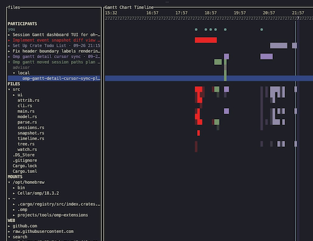

# antty

A terminal Gantt timeline of coding-agent sessions and the files they touched.



- Live session and subagent lanes
- Per-file activity rows
- Filesystem-watcher attribution of changes to tool calls, with diffs
- Session picker and detail/diff views

## Quick start

```
cargo install --path .
```

Then run `antty` from inside a project directory.

## Harness support

Currently reads oh-my-pi (omp) session logs. Other harnesses are planned.

## Docs

- [Installation](docs/installation.md)
- [Usage](docs/usage.md)
- [How it works](docs/how-it-works.md)
- [Architecture](docs/architecture.md)

## License

Licensed under either of [Apache License, Version 2.0](LICENSE-APACHE) or
[MIT license](LICENSE-MIT) at your option.

